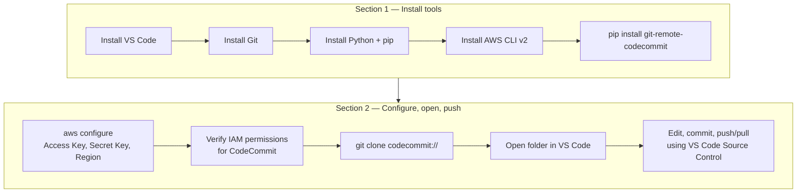

# Managing an AWS CodeCommit Repo with VS Code

Step-by-step setup for cloning, editing, and pushing to an AWS CodeCommit repository using
VS Code, Git, Python, the `git-remote-codecommit` credential helper, and the AWS CLI.

---

## Workflow



---

# Section 1 — Install the tools

What each tool is for:

| Tool | Why it's needed |
|---|---|
| **VS Code** | Editor with built-in Git/Source Control integration used to browse, edit, commit, and push. |
| **Git** | The actual version control client VS Code drives under the hood. |
| **Python + pip** | Required to install `git-remote-codecommit`, which is a Python package. |
| **AWS CLI v2** | Used to configure AWS credentials/region (`aws configure`) and to manage CodeCommit repos, IAM, etc. from the command line. |
| **`git-remote-codecommit`** | A Git credential helper (installed via `pip`) that lets `git` authenticate to CodeCommit using your AWS CLI credentials directly — no SSH keys or Git credential-helper setup needed. |

### 1.1 VS Code

Download and install from https://code.visualstudio.com/. Optionally add the **GitLens** and
**AWS Toolkit** extensions from the Extensions marketplace for richer Git history views and
direct AWS resource browsing.

### 1.2 Git

**Windows**:
```powershell
winget install --id Git.Git -e
```

**Linux (Debian/Ubuntu)**:
```bash
sudo apt update && sudo apt install -y git
```

Verify:
```bash
git --version
```

### 1.3 Python + pip

**Windows**: install from https://www.python.org/downloads/ (check "Add python.exe to PATH"
during install), or:
```powershell
winget install --id Python.Python.3.12 -e
```

**Linux**:
```bash
sudo apt install -y python3 python3-pip
```

Verify:
```bash
python3 --version
pip3 --version
```

> Per this project's Python conventions elsewhere, prefer `uv` for actual Python project/dependency
> work — but `git-remote-codecommit` here is installed as a global CLI tool via `pip`/`pipx`
> specifically because it needs to be on `PATH` for Git itself to invoke as a remote helper.

### 1.4 AWS CLI v2

**Windows**:
```powershell
winget install --id Amazon.AWSCLI -e
```

**Linux**:
```bash
curl "https://awscli.amazonaws.com/awscli-exe-linux-x86_64.zip" -o "awscliv2.zip"
unzip awscliv2.zip
sudo ./aws/install
```

Verify:
```bash
aws --version
```

### 1.5 `git-remote-codecommit`

```bash
pip install git-remote-codecommit
```

Verify it's on `PATH` (Git needs to find it as `git-remote-codecommit`):
```bash
git-remote-codecommit --version
```

If not found after install, ensure Python's user `Scripts`/`bin` directory is on `PATH`
(`pip show -f git-remote-codecommit` shows the install location).

---

# Section 2 — Configure, open the repo locally, and push to CodeCommit

### 2.1 Configure AWS credentials

```bash
aws configure
```

Prompts for:
- **AWS Access Key ID**
- **AWS Secret Access Key**
- **Default region name** (e.g. `us-east-1`)
- **Default output format** (e.g. `json`)

This writes to `~/.aws/credentials` and `~/.aws/config` (on Windows: `%USERPROFILE%\.aws\`).

> The IAM user/role behind these credentials needs at least the `AWSCodeCommitPowerUser` managed
> policy (or a custom policy granting `codecommit:GitPull`, `codecommit:GitPush`, and related
> actions) to interact with CodeCommit repos.

### 2.2 Clone the CodeCommit repository

With `git-remote-codecommit` installed, `git` gains support for a `codecommit://` URL scheme that
handles AWS SigV4 authentication automatically using your configured AWS CLI credentials — no
SSH key setup, no Git credential manager prompts.

```bash
git clone codecommit://<repository-name>
```

### 2.3 Open the repo in VS Code

```bash
code <repository-name>
```

### 2.4 Edit, commit, and push — using VS Code's Source Control panel

Open **Source Control** (`Ctrl+Shift+G`) and work exactly as with any other Git repo:

1. Make your edits in the editor.
2. In the Source Control panel, stage changes (`+` next to each file, or "Stage All Changes").
3. Type a commit message and commit (`Ctrl+Enter` or the checkmark button).
4. **Push** — click `...` → `Push`, or use the sync/push icon in the status bar. This talks to
   CodeCommit transparently via the `codecommit://` remote and your AWS CLI credentials — no extra
   authentication prompts, as long as `aws configure` is set up correctly.
5. **Pull** — same menu, `Pull`, to bring down remote changes before you start editing again.

No CodeCommit-specific VS Code configuration is required — from Git's point of view, `codecommit://`
is just another remote URL scheme, resolved by the `git-remote-codecommit` helper from Section 1.

To close the repo, just close the VS Code window/folder — there's nothing CodeCommit-specific to
tear down locally.

---

## Troubleshooting

| Issue | Likely cause / fix |
|---|---|
| `git: 'remote-codecommit' is not a git command` | `git-remote-codecommit` isn't on `PATH`. Re-check the `pip install` location and `PATH`. |
| `fatal: repository 'codecommit://...' does not exist` | Wrong repo name, wrong region, or the IAM identity lacks `codecommit:GitPull`/`GitClone` permission on that repo. |
| `An error occurred (AccessDeniedException)` on push | IAM user/role missing `codecommit:GitPush`, or the repo has branch protection/approval rules blocking a direct push. |
| Wrong AWS account/region used | Check `aws configure list`, or pass `--profile <name>` / use `codecommit://<profile>@<repo>` to target a specific named profile. |
| Credentials expire quickly (SSO/STS) | If using AWS SSO or temporary STS credentials, re-run `aws sso login` (or refresh the session) before pushing/pulling — the CodeCommit helper uses whatever credentials `aws` currently resolves. |
